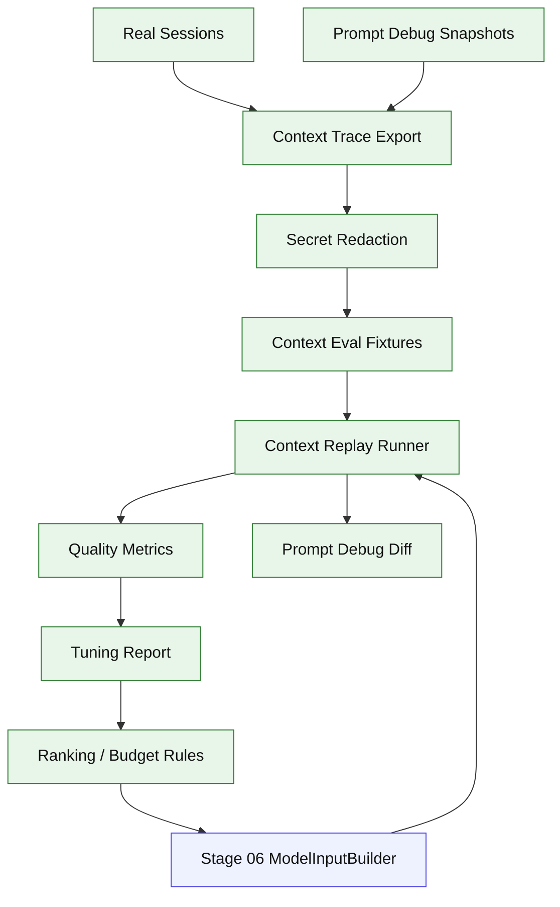

# Stage 15: Context Quality Optimization After Real Usage

## 1. 本阶段目标

Stage 15 不再扩展新能力，而是在 Stage 14 的可用 CLI 基础上，用真实使用 trace 优化 context 质量。它回答的问题不是“能不能把内容塞进 prompt”，而是“真实任务里模型拿到的上下文是否足够、干净、稳定、可解释，并且不会因为 budget、ranking、compaction 或 prompt cache 抖动降低工作质量”。

这个阶段应该放在 Stage 14 之后：没有真实 dogfooding、debug JSONL、session export 和完整 skill/memory/sub-agent 注入前，过早做 context 质量优化容易变成拍脑袋调 prompt。Stage 06 做架构地基，Stage 10/11/13 产生 ContextItem，Stage 15 基于真实数据做质量闭环。

闭环可调试性声明：本阶段完成后，可运行第 7 节中的 Demo commands 导出 context trace、构造 eval/replay fixture、比较两次 ModelInput、验证 token 校准和调优规则是否改善关键指标。

## 2. 前置依赖

| 依赖 | 用途 |
| --- | --- |
| Stage 06 | ContextItem、ModelInputBuilder、compaction、prompt debug |
| Stage 10 | skill catalog、progressive loading、memory v0 ContextItem |
| Stage 11 | sub-agent side transcript 和 summary ContextItem |
| Stage 13 | full memory retrieval、citations、extraction |
| Stage 14 | debug JSONL、doctor、session export、日常 dogfooding |
| Fixture provider | context replay 和 regression tests |

## 3. 三家方案提炼

| 维度 | OpenCode | Claude Code | Codex | Kai 选择 |
| --- | --- | --- | --- | --- |
| 质量信号 | usage、snapshot、compaction flag | prompt cache、context cleanup、tool result cleanup | protocol item、context snapshot、debug traces | context trace + eval/replay + debug diff |
| 优化对象 | overflow、summary、instruction | memory/skills/agent context、cache 稳定 | tool/context pollution guard | ContextItem ranking、budget、dedupe、summary quality |
| 验证方式 | session replay 思路 | 产品化 dogfooding | fixture/protocol 回放 | 真实 trace 抽样 + fixture regression + metric report |
| 调优边界 | 不把所有内容塞 prompt | progressive loading | 协议 item 可审计 | 调规则，不绕过 Stage 06 builder |

## 4. 源码引用（必读清单）

| 来源 | 参考点 |
| --- | --- |
| `$OPENCODE_REPO/packages/opencode/src/session/processor.ts` | usage、snapshot、compaction 标记 |
| `$OPENCODE_REPO/packages/opencode/src/session/compaction.ts` | summary anchoring、tail budget |
| `$OPENCODE_REPO/packages/opencode/src/session/overflow.ts` | usable context 计算 |
| `$CLAUDE_CODE_REPO/src/query.ts` | pending tool result cleanup、memory prefetch consume |
| `$CLAUDE_CODE_REPO/src/constants/prompts.ts` | 动态 prompt section 稳定性 |
| `$CODEX_REPO/codex-rs/core/src/session` | protocol item / context snapshot / debug replay 思路 |
| `$CODEX_REPO/codex-rs/core/src/stream_events_utils.rs` | external context pollution guard、citation trace 思路 |

## 5. 本阶段架构图（mermaid）



## 6. 详细设计

### 6.1 模块清单

| 文件路径 | 职责 | 预计行数 | 主要导出 |
|---|---|---:|---|
| `src/coding/context/quality/trace.ts` | 导出真实 turn 的 ContextItem、budget、cutReason、ModelInput 摘要 | ~110 | `exportContextTrace` |
| `src/coding/context/quality/redact.ts` | trace 脱敏，移除 key/token/private path | ~70 | `redactContextTrace` |
| `src/coding/context/quality/eval-set.ts` | 管理 eval fixtures 和期望关键事实 | ~90 | `ContextEvalSet` |
| `src/coding/context/quality/replay.ts` | 用 fixture 重放 ModelInputBuilder 和 compaction | ~120 | `replayContextFixture` |
| `src/coding/context/quality/metrics.ts` | 计算 token ratio、critical fact retained、stale/conflict/bloat | ~120 | `computeContextQualityMetrics` |
| `src/coding/context/quality/tuning.ts` | ranking/budget 调优规则和报告 | ~90 | `ContextTuningRule` |
| `src/debug/context-diff.ts` | 比较两次 prompt debug snapshot | ~50 | `diffContextDebugSnapshots` |

### 6.2 关键接口

```ts
export interface ContextQualityTrace {
  sessionId: string;
  turnId: string;
  createdAt: string;
  taskKind: "short_fix" | "long_refactor" | "debugging" | "plan" | "research" | "mixed";
  items: ContextDebugItem[];
  modelInputDigest: {
    systemHash: string;
    messageCount: number;
    toolCount: number;
    estimatedInputTokens: number;
    reservedOutputTokens: number;
  };
  outcome?: {
    completed: boolean;
    userCorrectionCount: number;
    retryCount: number;
    compactionCount: number;
  };
}

export interface ContextEvalFixture {
  id: string;
  trace: ContextQualityTrace;
  criticalFacts: string[];
  forbiddenFacts?: string[];
  expectedIncludedItemIds?: string[];
  expectedExcludedKinds?: ContextItemKind[];
}

export interface ContextQualityMetrics {
  inputTokenRatio: number;
  criticalFactRetention: number;
  staleOrConflictingItemCount: number;
  toolResultBloatRatio: number;
  summaryCompressionRatio: number;
  cacheStableSectionChurn: number;
  promptDebugDiffSize: number;
}

export interface ContextTuningRule {
  id: string;
  target: "budget" | "ranking" | "dedupe" | "compaction" | "cache_stability";
  description: string;
  enabledByDefault: boolean;
}
```

### 6.3 Eval 场景

| 场景 | 重点 |
| --- | --- |
| long task | 多轮修改后，approved plan、当前目标、关键错误和最近 diff 不丢 |
| noisy bash | 大量 stdout/stderr 不挤掉用户目标和失败摘要 |
| skill activation | 未激活 skill 只保留 catalog，激活 skill 的完整内容可解释进入 |
| memory conflict | 新 transcript 和旧 memory 冲突时，旧 memory 不应高优先级污染上下文 |
| sub-agent result | 子 Agent side transcript 不全文注入，只保留 summary、changed files、open questions |
| compaction regression | summary 后仍能继续任务，不丢 critical files/commands/errors |
| prompt cache stability | 静态 rules/profile/instruction 顺序稳定，动态项不打散 cache-stable 段 |

### 6.4 调优流程

1. 从真实 sessions 导出 context trace，默认脱敏后落到 `.kai/context-traces/` 或用户指定目录。
2. 挑选失败、反复纠正、长上下文、频繁 compaction 的 trace 做 eval fixture。
3. 为 fixture 标注 `criticalFacts`、`forbiddenFacts`、期望保留/裁剪的 item kind。
4. replay 当前 Context Kernel，生成 metric report 和 prompt debug diff。
5. 调整 per-kind budget、priority/ranking、dedupe、tool result formatter、summary schema 或 cacheStable 分段。
6. replay 对比新旧 metrics，只有关键指标改善且没有明显回归才固化规则。
7. 把高价值 fixture 加入 Stage 06/10/11/13 的 regression tests。

## 7. 实施步骤（Step-by-step）

1. 在 Stage 14 debug JSONL 基础上增加 context trace export。
2. 增加 trace redaction，覆盖 secret/token/private key/cookie/`.env` 值和本机敏感路径。
3. 定义 eval fixture schema，支持 critical/forbidden facts。
4. 写 replay runner：同一 fixture 可重建 ContextItem、预算裁剪、compaction 和 ModelInput debug。
5. 增加 metrics：token ratio、critical fact retention、stale/conflict、tool result bloat、summary compression、cache churn。
6. 增加 prompt debug diff：比较两次 builder 输出的 item 顺序、裁剪原因、hash 和 token 变化。
7. 基于 dogfooding trace 调整 budget/ranking/dedupe/summary 规则。
8. 写 tuning report，记录每条规则的收益、风险和回滚方式。
9. 把关键 fixture 加入 CI 或本地 `bun test -- stage-15`。

Demo commands:

```bash
bun run kai context trace --session <session-id> --out .kai/context-traces
bun run kai context eval fixtures/context-quality/*.json
bun run kai prompt --debug --compare <session-a> <session-b>
bun run kai context tune --fixture fixtures/context-quality/long-task.json
bun test -- stage-15
```

## 8. 验收标准

| 验收项 | 标准 |
| --- | --- |
| trace export | 可从真实 session 导出 ContextItem、budget、cutReason、ModelInput digest |
| redaction | trace export 默认脱敏 secret/token/private key/cookie/`.env` 值和敏感本机路径 |
| eval fixtures | 覆盖 long task、noisy bash、skill activation、memory conflict、sub-agent result、compaction regression |
| replay | fixture 能 deterministic 重放 Context Kernel 输出 |
| metrics | 至少输出 token ratio、critical fact retention、stale/conflict count、tool result bloat、summary compression、cache churn |
| debug diff | 能比较两次 prompt debug snapshot 的 item 顺序、裁剪原因和 token 变化 |
| tuning report | 每次调优记录规则、收益、风险、回滚方式 |
| regression | Stage 06/10/11/13 的典型 context fixture 纳入测试 |
| 不绕过地基 | 所有优化都作用于 ContextItem/budget/builder/formatter，不新增旁路 prompt 拼接 |
| 代码预算 | 累计核心代码约 11060 行 |

## 9. 已知限制 & 后续衔接

Stage 15 仍然不引入向量数据库、云端团队 trace 平台或自动在线学习。它先把本地真实使用质量闭环建立起来：trace 可导出、eval 可重放、metric 可比较、规则可回滚。后续如果要做 embedding hybrid retrieval、团队共享 context eval 或 provider-specific prompt cache 深度优化，应基于这里的 trace/eval 资产继续扩展。
